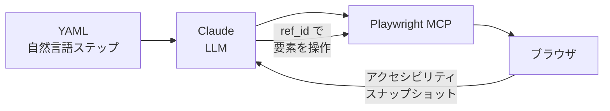

## TL;DR

- **claude-test** は YAML + 自然言語でテストを定義し、AI がブラウザを操作して検証するフレームワーク
- セレクタの保守から解放される代わりに、テストの決定論性や振る舞い検知に新たなリスクが生まれる
- デモアプリを作って実際に4テストケース・56ステップを実行し、何ができて何ができないかを検証した

## この記事を書いた背景

チームで E2E テストの保守コストに悩んでいたとき、**claude-test** というツールを見つけました。「YAML に自然言語でテストを書けば AI が実行してくれる」——しかも日本語の記事はまだゼロ。

面白そうだと思う一方で、疑問もありました。**セレクタの解決を AI に任せたテストは、テストとして信頼できるのか？** PO やQA に書いてもらえるレベルなのか？ 実際にデモアプリを作って検証してみることにしました。

## E2E テストの理想と現実

### テストピラミッドの頂点にある理由

E2E テストは**ユニットテストでは検出できないコンポーネント間の結合不具合**を検出するために存在します。ユーザーが実際にたどる操作フローを通して、システム全体が正しく動くかを保証するものです。

Martin Fowler は「Practical Test Pyramid」でこう述べています。

> テストピラミッドの本質は、低レベルのユニットテストを多く、GUI を通じた高レベルのテストを少なくすべきということだ

https://martinfowler.com/articles/practical-test-pyramid.html

推奨比率は**ユニット 70% / 統合 20% / E2E 10%**。E2E テストは量を絞り、**最も重要なユーザージャーニーだけ**に限定するのがセオリーです。

### なぜ嫌われるのか

セオリーは分かっていても、現場では E2E テストが嫌われがちです。

| 課題 | 具体的な痛み |
| --- | --- |
| **セレクタが壊れる** | CSS クラスの変更、UI 部品の差し替えでテストが即死する |
| **保守コストが異常に高い** | Selenium 系ユーザーは**テスト時間の 80% を保守に費やす**（Virtuoso QA 調査）|
| **属人化する** | 特定のエンジニアしか触れず、その人が抜けると放置される |
| **遅い** | フルスタックの起動が必要で、実行に分単位かかる |
| **壊れても直されない** | 「テスト通らないからスキップ」が常態化する |

https://tech.andpad.co.jp/entry/2023/10/02/100000

### 「非エンジニアがテストを書く」という理想はすでにあった

この課題に対する答えとして、**BDD（振る舞い駆動開発）** が生まれました。Gherkin 構文を使えば、非技術者でも仕様を書けるという思想です。

```gherkin
Given ユーザーがログインページにいる
When ユーザー名に "test" を入力する
And パスワードに "password" を入力する
Then ダッシュボードが表示される
```

しかし BDD には構造的な限界がありました。**Gherkin で仕様は書けても、裏側のステップ実装はエンジニアの仕事**です。PO が「ログインボタンをクリック」と書いても、Playwright のコードへの変換は別途必要でした。

## claude-test とは

**claude-test** は、この「裏側のステップ実装」を AI に任せるアプローチを取るフレームワークです。

https://github.com/terryso/claude-test

YAML に自然言語でテストを書くと、**Playwright MCP** を通じて AI がブラウザを操作し、テストを実行します。

### Before / After

**従来の Playwright テスト：**

```javascript
await page.goto('https://example.com');
await page.locator('#username').fill('test_user');
await page.locator('#password').fill('secret');
await page.locator('button[type="submit"]').click();
await expect(page.locator('.dashboard')).toBeVisible();
```

**claude-test の YAML：**

```yaml
steps:
  - "Open {{BASE_URL}} page"
  - "Fill username field with {{TEST_USERNAME}}"
  - "Fill password field with {{TEST_PASSWORD}}"
  - "Click login button"
  - "Verify page displays Dashboard"
```

セレクタが消えました。`#username` や `button[type="submit"]` のような実装の詳細が一切ありません。

### 仕組み

claude-test の裏側では以下が起きています。



1. **Playwright MCP** がページを読み込み、すべてのインタラクティブ要素をスキャンする
2. 各要素に動的な **ref_id** を割り当てる
3. アクセシビリティスナップショット（要素の説明と ref_id の対応表）を作成する
4. AI が自然言語のステップを ref_id 経由で実行する

つまり、**セレクタの解決を人間ではなく AI が担う**構造です。

## 公式ドキュメントから見えた claude-test の正体

### テストステップは2種類ある

公式リポジトリのテストケースを読むと、ステップが2種類に分かれていることがわかります。

**操作指示（要素の特定を AI に委ねる）：**

```yaml
- "Click Add to Cart button for first product"
- "Click shopping cart icon in top right"
```

**検証（期待値を人間がハードコードする）：**

```yaml
- "Verify product name is Sauce Labs Backpack"
- "Verify product price is $29.99"
- "Verify first product price is $7.99"
```

これは重要なポイントです。claude-test は「全部 AI にお任せ」ではありません。

| | 要素の特定 | 期待値の定義 |
| --- | --- | --- |
| 従来の Playwright | 人間（セレクタ） | 人間（assert） |
| claude-test | **AI**（ref_id） | **人間**（YAML に記述） |

**「何を確認するか」は人間が決め、「どうやって要素を見つけるか」は AI が担う**という分業です。

### 公式が語っていないこと

公式ドキュメントとテクニカルデザインを全て読みましたが、以下の論点への言及はありませんでした。

| 論点 | 公式の記述 |
| --- | --- |
| テスト結果の決定論性 | なし |
| AI 解釈の再現性 | なし |
| flaky test への対策 | なし |
| このツールが代替しないもの | なし |

Medium の記事では「2,000行→200行」「オンボーディング3日→30分」といった主張がありますが、テストの信頼性についてはまったく触れていません。

https://medium.com/@oxtiger/stop-writing-brittle-playwright-tests-why-yaml-based-testing-is-the-future-5cc90a81bfa2

## 実際に試してみた

検証用に、Lit 3 + Tailwind CSS 4 + Vite 6 で**3画面構成のお問い合わせフォーム**を作りました。入力→確認→送信完了の典型的なフォームフローです。

https://github.com/kamegoro/claude-test-demo

### セットアップ

```bash
npm install -g claude-test
claude-test init
```

`claude-test init` を実行すると、プロジェクトの `.claude/` 配下にフレームワークがまるごとコピーされます。スラッシュコマンド定義、YAML パーサー、レポート生成器など、合計**約 476KB**のファイルが展開されます。

ここで違和感を覚えました。ESLint や Playwright など従来のツールは `package.json` + `node_modules` で管理され、`npm install` でチーム全員が同じバージョンを使えます。しかし claude-test は npm の依存管理に乗りません。アップデートは `claude-test update` を手動実行する必要があり、lockfile のような仕組みもありません。

### YAML テストケースの実例

実際に書いたテストケースを紹介します。

**共通ステップ（steps/fill-valid-form.yml）：**

```yaml
steps:
  - "「お名前」フィールドに「山田太郎」と入力する"
  - "「メールアドレス」フィールドに「yamada@example.com」と入力する"
  - "「カテゴリ」ドロップダウンから「機能リクエスト」を選択する"
  - "「お問い合わせ内容」フィールドに「テスト用のお問い合わせ内容です。デモアプリの動作確認をしています。」と入力する"
```

**正常系テスト（test-cases/happy-path.yml）：**

```yaml
tags:
  - smoke
  - happy-path
steps:
  - include: "navigate-to-form"
  - include: "fill-valid-form"
  - "「確認する」ボタンが有効であることを確認する"
  - "「確認する」ボタンをクリックする"
  - "ページに「入力内容の確認」と表示されていることを確認する"
  - "ページに「山田太郎」と表示されていることを確認する"
  - "ページに「yamada@example.com」と表示されていることを確認する"
  - "ページに「機能リクエスト」と表示されていることを確認する"
  - "「送信する」ボタンをクリックする"
  - "ページに「送信が完了しました」と表示されていることを確認する"
  - "ページに「SUB-」を含むテキストが表示されていることを確認する"
```

:::details バリデーションテスト（test-cases/validation.yml）
```yaml
tags:
  - smoke
  - validation
steps:
  - include: "navigate-to-form"
  - "「お名前」フィールドをクリックしてからフィールド外をクリックする"
  - "ページに「お名前は必須です」と表示されていることを確認する"
  - "「メールアドレス」フィールドをクリックしてからフィールド外をクリックする"
  - "ページに「メールアドレスは必須です」と表示されていることを確認する"
  - "「お問い合わせ内容」フィールドをクリックしてからフィールド外をクリックする"
  - "ページに「お問い合わせ内容は必須です」と表示されていることを確認する"
  - "「確認する」ボタンが無効であることを確認する"
  - "「メールアドレス」フィールドに「invalid-email」と入力する"
  - "「メールアドレス」フィールド外をクリックする"
  - "ページに「正しいメールアドレスを入力してください」と表示されていることを確認する"
  - "「お問い合わせ内容」フィールドに「短い」と入力する"
  - "「お問い合わせ内容」フィールド外をクリックする"
  - "ページに「10文字以上で入力してください」と表示されていることを確認する"
```
:::

率直に、**驚くほど読みやすい**です。Playwright のコードを見たことがない人でも、何をテストしているか一目でわかります。`include` による共通ステップの再利用、タグベースのフィルタリングなど、テストフレームワークとしての基本的な構造も備えています。

### 実行結果

4つのテストケース（正常系・バリデーション・戻るボタン・送信後リセット）を実行しました。

| テストケース | ステップ数 | 実行時間 | 結果 |
| --- | --- | --- | --- |
| happy-path | 15 | 約32秒 | PASSED |
| validation | 15 | 約28秒 | PASSED |
| back-preserves-data | 12 | — | PASSED |
| submit-another | 14 | — | PASSED |
| **合計** | **56** | — | **全パス** |

全テストがパスしました。しかし、注目すべきは**実行時間**です。15ステップの正常系テストに約32秒かかっています。各ステップで「LLM の推論 → Playwright 操作 → アクセシビリティスナップショット取得」が発生するためです。

同等の Playwright テストなら数秒で終わります。**実行速度は桁違いに遅い**のが現実です。

### 実行中に起きたこと

テスト実行中にいくつかの問題に遭遇しました。

**Vite HMR との干渉：** テスト実行中にソースファイルが読み取られると、Vite の HMR（Hot Module Replacement）によってブラウザがリロードされ、フォームの入力状態がリセットされました。1回目の happy-path 実行では、確認画面への遷移直後にフォームの初期化が起きています。

**ポート番号の不安定さ：** `.env.dev` に `BASE_URL=http://localhost:5173` と設定しましたが、ポート 5173 が使用中だった場合、Vite は自動的に 5174 にフォールバックします。テスト側の URL と実際のサーバーのポートがずれると、テストは当然失敗します。

**デバッグの難しさ：** テストが失敗したとき、原因の切り分けが困難です。LLM の解釈が悪かったのか、アプリのバグなのか、タイミングの問題なのか。従来の Playwright テストなら「セレクタが見つからない」「期待値と一致しない」と明確にわかりますが、claude-test ではその境界が曖昧です。

## PO が書けるレベルか？

### 書ける部分

YAML テストケースの**記述自体**は、Playwright の知識がゼロでも書けます。「フィールドに入力する」「ボタンをクリックする」「ページに表示されていることを確認する」——日本語で操作手順を書くだけです。

BDD の Gherkin と比較すると、**ステップ実装が完全に不要になった**点は大きな進歩です。Gherkin では `When ユーザー名に "test" を入力する` と書いても、裏側の `page.locator('#username').fill('test')` を別途エンジニアが実装しなければなりませんでした。claude-test ではその層を AI が担います。

`include` による共通ステップの再利用も直感的です。「フォームに移動する」「有効なデータを入力する」といった共通操作を一度定義すれば、テストケース間で使い回せます。

### 書けない部分

しかし、PO が一人で完結できるかというと、**現時点では難しい**と感じました。

**環境構築の壁：** `claude-test init` 以前に、Node.js のインストール、`npm install -g claude-test`、Vite の起動、ポート番号の確認といった手順が必要です。これはエンジニアの領域です。

**デバッグができない：** テスト失敗時、PO には原因を特定する手段がありません。LLM の解釈の問題なのか、アプリのバグなのか、環境の問題なのか。エンジニアのサポートなしには先に進めません。

**「何を検証すべきか」の設計：** テストの書き方は簡単でも、**何をテストすべきか**の判断にはテスト設計の知識が要ります。「確認画面に名前が表示される」は思いつけても、「戻るボタンでデータが保持される」「バリデーションエラー中はボタンが無効化される」といったエッジケースは、PO が自然に思いつくものではありません。

### BDD との比較

| | BDD (Gherkin) | claude-test |
| --- | --- | --- |
| 仕様記述 | PO が書ける | PO が書ける |
| ステップ実装 | エンジニアが必要 | **不要（AI が担う）** |
| 環境構築 | エンジニアが必要 | エンジニアが必要 |
| デバッグ | エンジニアが必要 | エンジニアが必要 |
| テスト設計 | 協働が必要 | 協働が必要 |

結局、**ステップ実装の壁だけが取り除かれた**状態です。PO が「一人で」テストを書いて回せる世界には、まだ届いていません。

## 現時点の課題と限界

### Deterministic（決定論性）の問題

従来のテストフレームワークでは「同じテストを何回実行しても同じ結果になる」が大前提です。claude-test ではこの前提が成り立ちません。

各ステップで LLM がアクセシビリティスナップショットを解釈して要素を特定するため、実行パスが毎回微妙に異なります。今回の検証では4テストケースすべてがパスしましたが、**次回も同じ結果になる保証はありません**。

CI/CD パイプラインへの組み込みを考えると、これは致命的です。テストが非決定的なら、失敗のたびに「本当のバグか、AI の気まぐれか」を人間が判断しなければなりません。

### 振る舞いの変化を検知できない問題

テストには**構造の変化に鈍感で、振る舞いの変化に敏感**であることが求められます。claude-test は前者を達成しましたが、後者にリスクを抱えています。

たとえば `「確認する」ボタンをクリックする` というステップ。このボタンのラベルが「次へ進む」に変わったら、テストはどうなるでしょうか？ 従来の Playwright なら `getByRole('button', { name: '確認する' })` で即座に失敗し、UI の変更を検知できます。

claude-test の場合、AI が「確認画面に進むためのボタンだろう」と文脈から推測し、「次へ進む」ボタンを押してテストを通す可能性があります。UI の意図的な変更を**テストが検知しない**のです。

参考として、Kent C. Dodds が提唱する**アクセシビリティベースのテスト**は、このバランスの理想形です。

```javascript
// CSS が変わっても壊れない（構造に鈍感 ✅）
// テキストが変わったら壊れる（振る舞いに敏感 ✅）
screen.getByRole('button', { name: 'ログイン' });
```

https://kentcdodds.com/blog/testing-implementation-details

### モジュール管理の問題

`claude-test init` は `.claude/` ディレクトリにフレームワークをまるごとコピーする設計です。npm の依存管理には乗りません。

チーム開発で考えると、以下の問題が浮かびます。

- `.claude/` を git 管理する必要があるものの、生成された JS ファイルを含むためコンフリクトが起きやすい
- チームメンバーが異なるバージョンの claude-test CLI を持っていると、`update` 時にファイルが変わる
- lockfile がないため、誰がいつ update したかは `.framework-version` の日時でしか追えない
- `.claude/scripts/` のファイルを誤って編集しても検知する仕組みがない

従来のツールチェインが `package.json` + `node_modules` で解決してきた「バージョンの一貫性」の問題が、そのまま残っています。

### コスト

各ステップで Claude API を消費します。今回の検証では 56 ステップを実行しましたが、ステップごとに LLM の推論が走るため、相当量のトークンを消費します。

ローカル開発での手動実行なら許容範囲かもしれません。しかし **CI で毎コミット実行する**運用を考えると、コストは急激に跳ね上がります。従来の E2E テストの実行コストは基本的にインフラ費用だけですが、claude-test では API 利用料が上乗せされます。

## まとめ

### claude-test は何のテストなのか

公式は「YAML-based Playwright MCP testing framework」と謳っています。Playwright のラッパーであり、E2E テストの代替を目指しているように見えますが、従来の E2E テストとは本質的に異なるものです。

従来の E2E テストは**決定論的**です。「このボタンを押したら、この画面が表示される」を厳密に検証し、デプロイ判断の根拠になります。

claude-test は**探索的テストの自動化**に近いものです。人間が手動で行う探索的テストを YAML で記述可能にしたものと捉えるのが適切でしょう。

### PO が E2E テストを書ける時代は来たのか？

**テストケースの記述**に限れば、答えは「はい」です。YAML と日本語で操作手順を書くだけなら、PO でも十分にできます。

しかし**記述・実行・結果解釈・問題修正**というサイクル全体を見れば、答えは「まだ」です。環境構築やデバッグ、テスト設計にはエンジニアのサポートが欠かせません。

### 従来の E2E テストを代替するか、補完するか

**代替ではなく、補完**です。

claude-test はセレクタの保守コストと記述の敷居を大きく下げました。一方で、決定論性と振る舞い検知にリスクを抱えています。得るものと失うものが明確に存在する以上、適材適所で使い分けるのが現実的です。

| テストの種類 | ツール | 目的 |
| --- | --- | --- |
| クリティカルパスの回帰テスト | Playwright | デプロイ判断の根拠 |
| 探索的テスト・受け入れテスト | claude-test | 仕様の言語化と共有 |

claude-test は「PO がテストを書ける世界」への一歩目として意味のあるツールです。ただし、**テストとしての信頼性**と**ツール紹介のきらびやかさ**を混同してはいけません。

E2E テストの保守に疲れているチームにとって、claude-test は「銀の弾丸」ではなく「新しい選択肢」です。その選択肢がどこまで育つかは、非決定性とモジュール管理の課題がどう解決されるかにかかっています。
